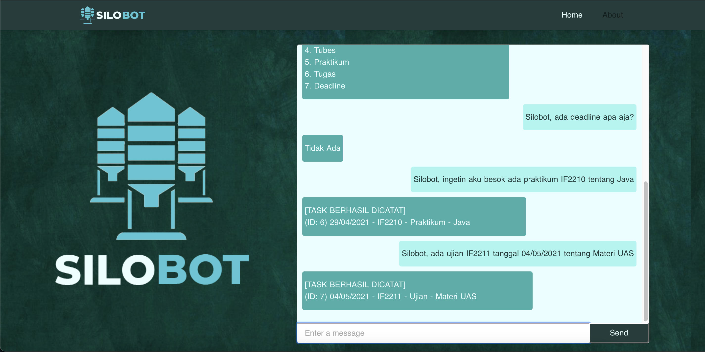
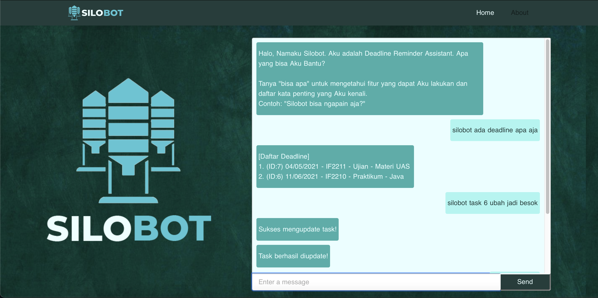
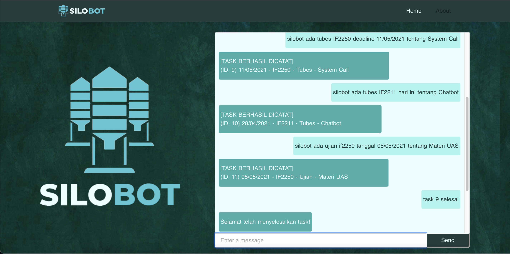

# SiloBot - Your Deadline Assistant Bot
Hello, this is our group project for IF2211 - Strategi Algoritma course. This is a chatbot to assist you in remembering all the task deadlines that you have so that all of your assignments can be completed on time.

## Table of contents
* [General info](#general-info)
* [Technologies](#technologies)
* [Setup](#setup)
* [Features](#features)
* [Examples](#examples)
* [Developers](#developers)

## General info
Silobot is a chatbot which is inspired by the Google Assistant application. This application is a simple chatbot that functions to help users remember various deadlines, important dates, and certain tasks. We built this chatbot using the Knuth-Morris-Pratt algorithm and regular expressions.

## Technologies
This chat is built with:
* Vue.js
* Nuxt.js
* PostgreSQL
* NodeJS
* ExpressJS
* Heroku

## Setup
This chatbot is deployed using Heroku and can be accessed through [this link](https://silobot-if.herokuapp.com).

## Features
You can use this chatbot to add your task deadlines using these keywords:
1. Kuis 
2. Ujian 
3. Tucil 
4. Tubes 
5. Praktikum 
6. Tugas 
7. Deadline

## Examples
* Add a new task

* Update a task deadline

* Mark a task as done

## Developers
* Andres Jerriel Sinabutar - 13519218
* Shifa Salsabiila - 13519106
* Gde Anantha Priharsena - 13519026

Program Studi Teknik Informatika  
Institut Teknologi Bandung
